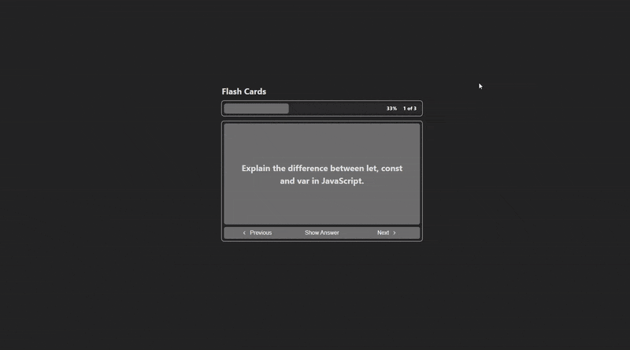

# Flash Cards App


> Projeto de estudo baseado na proposta do [roadmap.sh](https://roadmap.sh/projects/flash-cards), implementado com React para revisar conceitos de JavaScript de forma interativa.

## 📸 Demonstração



## Sobre o Projeto

O **Flash Cards App** é uma aplicação simples que permite revisar perguntas e respostas, uma de cada vez.  
Este projeto faz parte da lista de projetos recomendados em [roadmap.sh/projects/flash-cards](https://roadmap.sh/projects/flash-cards) para treinar habilidades práticas com tecnologias web.

Objetivos de aprendizado:

- Utilizar **hooks do React** (`useState`, `useEffect`)
- Criar e organizar **componentes reutilizáveis**
- Controlar estado e fluxo da aplicação

## Funcionalidades

- 📖 Exibe perguntas e respostas em formato de flash card.
- 🔁 Alterna entre pergunta e resposta.
- ⏮️ Botões de navegação para avançar e voltar.
- 📊 Barra de progresso com porcentagem e posição atual.

## Como Rodar o Projeto

```bash
# 1. Clone o repositório
git clone https://github.com/seu-usuario/flash-cards-app.git
cd flash-cards-app

# 2. Instale as dependências
yarn install

# 3. Inicie o servidor de desenvolvimento
yarn dev
```
